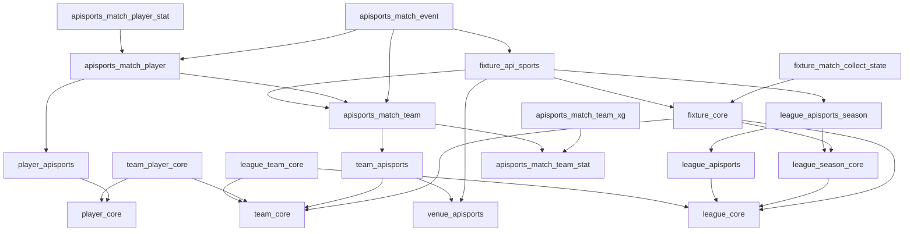

# Fixture / LeagueSeason 첫 suite의 원본 스키마 분석

이 문서는 범용 benchmark 환경의 첫 번째 case study인 Fixture / LeagueSeason suite에 한정합니다. 전체 프로젝트의 목적과 다른 suite의 확장 원칙은 [benchmark-methodology.md](benchmark-methodology.md)를 따릅니다.

초기 조사 commit: `9c99557d1d03eff1d82337e96f0168a2746b33e8`.
source of truth: `../../footballay-core/src/main/resources/db/migration` V1~V11, Kotlin persistence entity와 repository. 설명 문서나 JPA schema generation으로 구조를 추정하지 않습니다. 실행 시 실제 catalog와 migration hash를 별도 기록합니다. production의 수동 DDL 여부는 알 수 없습니다.

## Migration 누적 결과

V1은 신형 Core/ApiSports와 구형 Java 모델을 모두 생성합니다. V2는 Mock Backbone, V3은 League match_collect, V4는 Fixture 수집 상태 및 scan index, V5는 Core season, V6은 Fixture season FK와 복합 인덱스, V7은 provider→Core season FK, V8은 기존 provider season 중복 정리/backfill 및 league/year UNIQUE, V9는 Core season 링크 UNIQUE, V10은 Fixture season backfill, V11은 name_ko 삭제와 localization UID FK를 추가합니다. V10 이후에도 Fixture season FK는 nullable입니다.

## FK graph

화살표는 자식(FK 소유자) → 부모입니다.

FixtureApiSports의 home/away는 TeamApiSports가 아니라 경기별 Match Team입니다. 별도 신형 lineup 테이블은 없으며 formation/grid/substitute로 표현합니다. 구형 `fixtures`, `leagues`, `teams`, `player`, `match_lineup`, `match_player`, `player_statistics`, `team_statistics`, `fixture_event`, `expected_goals`는 이번 대상과 FK graph가 다릅니다. 모든 Flyway 테이블을 만들되 해당 구형 데이터, Mock Backbone, 사용자/standing/localization은 seed하지 않습니다.

## 제약

생성 테이블의 PK는 모두 BY DEFAULT IDENTITY bigint이며 명시적 ID COPY가 가능합니다. Core UID와 Match Player UID는 NOT NULL/UNIQUE입니다. League/Team/Player name과 각 NOT NULL boolean, Core season의 league/year, Event sequence, xG의 statistics/time/value를 반드시 제공합니다.

LeagueTeam은 두 FK가 필수이며 조합 UNIQUE입니다. TeamPlayer는 두 FK가 필수지만 조합 UNIQUE가 없어 중복을 별도 검증합니다. Core season의 league/year UNIQUE와 current flag는 별개이며 current 하나라는 제약은 SQL로 검증합니다. Provider season은 league/year 및 Core season FK 각각 UNIQUE이지만 nullable입니다.

Core→Backbone 연결 FK는 Backbone에 있으며 각각 nullable/UNIQUE입니다. League/Fixture api_id는 필수/UNIQUE, Team/Player/Venue api_id는 그 제약이 없습니다. Fixture의 legacy League와 season League 일치는 DB가 강제하지 않습니다.

FixtureApiSports의 home/away Match Team FK는 각각 UNIQUE입니다. 양쪽 컬럼을 합친 전역 재사용 방지는 별도 검증합니다. Match Team statistics_id는 entity가 OneToOne이어도 Flyway에 UNIQUE가 없으므로 추가 DDL 없이 검증합니다. Player Stat match_player_id는 UNIQUE, xG는 (statistics_id,elapsed_time) UNIQUE입니다. Event의 fixture/sequence UNIQUE는 없습니다.

정상 dataset은 nullable 관계도 채웁니다. scale의 미표본 Match Team에는 statistics/formation이 없으며 players/events/xG도 없습니다. Match Player/이벤트의 nullable provider나 assist 관계는 실제 FK 의미를 따릅니다. 구형 이름의 컬럼/테이블을 신형 FK로 혼동하지 않습니다.

## 생성 및 COPY dependency 순서

1. league_core, team_core, player_core, venue_apisports.
2. league_apisports, team_apisports, player_apisports.
3. league_team_core, team_player_core.
4. league_season_core, league_apisports_season.
5. fixture_core.
6. apisports_match_team_stat → apisports_match_team.
7. fixture_api_sports.
8. apisports_match_player → apisports_match_player_stat.
9. apisports_match_team_xg, apisports_match_event.
10. fixture_match_collect_state.

모든 FK/UNIQUE를 활성화한 상태에서 적재하며 생성 ID 조회나 임시 제약 해제를 사용하지 않습니다.

## Realistic cardinality

| Tables | Each rows |
|---|---:|
| league_core, league_apisports | 5 |
| team_core, team_apisports, venue_apisports, league_team_core | 100 |
| player_core, player_apisports, team_player_core | 2,500 |
| league_season_core, league_apisports_season | 50 |
| fixture_core, fixture_api_sports, fixture_match_collect_state | 19,000 |
| apisports_match_team, apisports_match_team_stat | 38,000 |
| apisports_match_player | 684,000 |
| apisports_match_player_stat | 532,000 |
| apisports_match_team_xg | 114,000 |
| apisports_match_event | 212,800 |

선발11+벤치7, 실제 출전14명/팀. 각 경기 교체3명/팀. xG 30/60/90분. A~E의 점수는 0-0/1-0/2-1/3-2/1-1이며 이벤트 수는 8/9/11/16/12입니다. 19,000경기에 각 preset 3,800회씩 적용합니다. 이벤트는 순서0부터 시작하며 교체 player는 투입, assist는 아웃 선수입니다.

## Repository와 인덱스

`FixtureCoreRepository.findFixturesByLeagueUidInKickoffRange`는 관리자 경로, `findApiSportsBackedFixturesByLeagueUidInKickoffRange`는 `FixtureScheduleReadQueryServiceImpl`의 기본 일정 경로입니다. 둘 다 legacy f.league.uid와 [from,to), kickoff ASC를 사용하며 available 필터는 없습니다. fetch join 차이와 projection을 보존하여 대응 SQL을 작성했습니다. season-aware 날짜 조회는 현재 Repository 구현이 아니라 비교 후보입니다.

`findFinishedCollectCandidateFixtures`는 legacy League + season current를 함께 참조하며 available=false, League available/matchCollect, 수집 상태, kickoff 범위, 정렬/페이지 제한을 사용합니다. 미래 lineup/stats/event benchmark의 기반은 `FixtureApiSportsRepository`의 `findFixtureHomeTeamLineupAndStatsByUid`, away 대응 메서드, `findEventsByFixtureUid`입니다. 이번 측정 suite에는 아직 포함하지 않습니다.

| Index | Columns |
|---|---|
| idx_fixture_core_match_collect_scan | available,kickoff,league_id |
| idx_fixture_core_league_season_kickoff | league_season_id,kickoff |
| idx_fixture_core_league_season_available_kickoff | league_season_id,available,kickoff |
| uc_league_season_core_league_year | UNIQUE league_core_id,season_year |
| idx_league_season_core_league_current | league_core_id,current |
| idx_league_apisports_season_core | league_season_core_id |
| uc_league_apisports_season_core | UNIQUE league_season_core_id |
| idx_match_collect_status_collected | match_collect_status,last_collected_at |

나머지 PK/UID/UNIQUE 인덱스는 manifest catalog에 모두 기록합니다. `(league_id,kickoff)`는 Flyway에 없습니다. baseline에 추가하지 않습니다.
